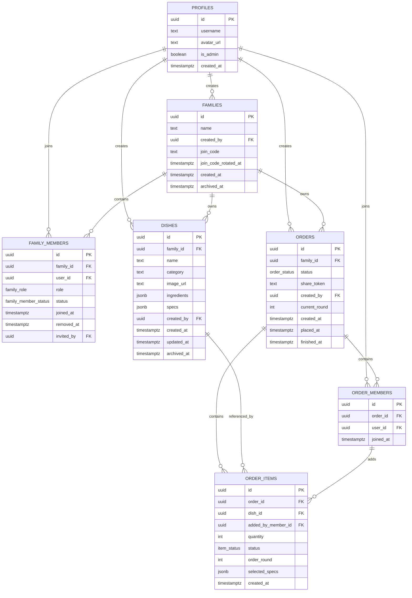

# Family v1 设计稿

## 1. 文档目标

这份文档用于把当前多家庭方案收敛成可执行规格，作为 Phase 0-2 的单一事实源。

适用范围：

- 数据模型与租户边界
- 角色与权限模型
- 登录、注册与家庭归属流程
- RLS 设计原则与矩阵
- Phase 0-2 实施清单
- README 改写提纲

本文优先保证 v1 可落地，不追求一次性覆盖未来全部扩展。

## 2. v1 收敛决策

### 2.1 已冻结决策

- 新用户必须先归属一个家庭后才能进入主应用。
- Auth 采用真实邮箱密码注册登录；`username` 仅作为资料字段与展示名。
- 注册页直接完成账号创建与家庭归属，不再采用“注册成功后进入单独 onboarding 子页面”的流程。
- 注册页默认主路径是“输入邀请码加入家庭”；“创建家庭”是页内低频展开分支。
- 若注册页同时填写邀请码和家庭名称，按邀请码优先处理。
- 业务权限采用家庭级角色，不再使用全局管理员承载业务授权。
- `profiles.is_admin` 如保留，仅表示平台运维角色，不参与家庭业务权限判断。
- 菜品管理权限仅授予 `family_owner` 和 `family_admin`。
- 家庭邀请码支持刷新，刷新后旧码失效。
- 用户退出家庭或被移出家庭后，历史记录保留，但失去该家庭后续访问权限。
- 家庭自助解散不纳入 v1，只允许平台侧人工处理。

### 2.2 核心抽象

从：

`User -> Order -> Dish`

改为：

`User -> Family -> Order -> OrderItem -> Dish`

### 2.3 三条基础原则

- `Family` 是租户边界，菜单、订单、成员都从属于家庭。
- 业务权限属于家庭成员关系，不属于全局用户。
- 只有家庭活跃成员可以加入订单并参与点菜。

### 2.4 关键 UI 决策

- Android 统一去掉 stretch overscroll。
- Menu 使用双列密集卡片，图片区约占卡片 60% 高度。
- 菜品卡片主路径直接加减菜；点击图片才打开菜品详情 sheet。
- Orders tab 直接展示当前订单详情，不再提供“进入订单”按钮。
- 家庭切换统一保留 app bar 入口，页面内容区不再重复渲染家庭切换卡片。
- 设置页优先用 sheet 完成个人资料、成员管理、历史订单等次级任务。

## 3. 领域模型

### 3.1 枚举定义

- `family_role`: `owner | admin | member`
- `family_member_status`: `active | removed`
- `order_status`: `ordering | placed | finished`
- `item_status`: `waiting | cooking | done`

### 3.2 表结构

#### `profiles`

用途：用户基础档案，跨家庭共享，但不承载业务权限。

字段：

- `id uuid primary key references auth.users(id) on delete cascade`
- `username text not null unique`
- `avatar_url text null`
- `is_admin boolean not null default false`
- `created_at timestamptz not null default now()`

约束与规则：

- `username` 全局唯一。
- `is_admin` 仅用于平台运维，不用于 UI 菜品管理、订单管理、成员管理授权。

#### `families`

用途：租户根实体。

字段：

- `id uuid primary key default gen_random_uuid()`
- `name text not null`
- `created_by uuid not null references profiles(id)`
- `join_code text not null unique`
- `join_code_rotated_at timestamptz not null default now()`
- `created_at timestamptz not null default now()`
- `archived_at timestamptz null`

约束与规则：

- `join_code` 用于已登录用户加入家庭。
- `archived_at` 仅供平台侧保留扩展，不在 v1 暴露自助归档入口。

#### `family_members`

用途：家庭成员与业务角色映射。

字段：

- `id uuid primary key default gen_random_uuid()`
- `family_id uuid not null references families(id) on delete cascade`
- `user_id uuid not null references profiles(id) on delete cascade`
- `role family_role not null`
- `status family_member_status not null default 'active'`
- `joined_at timestamptz not null default now()`
- `removed_at timestamptz null`
- `invited_by uuid null references profiles(id)`

约束与规则：

- `unique (family_id, user_id)`
- v1 默认一个用户可加入多个家庭，但首次进入主应用时必须至少归属一个家庭。
- 只有 `status = 'active'` 的成员拥有家庭访问权。

#### `dishes`

用途：家庭级菜单。

字段：

- `id uuid primary key default gen_random_uuid()`
- `family_id uuid not null references families(id) on delete cascade`
- `name text not null`
- `category text not null`
- `image_url text null`
- `ingredients jsonb not null default '[]'`
- `specs jsonb not null default '[]'`
- `created_by uuid not null references profiles(id)`
- `created_at timestamptz not null default now()`
- `updated_at timestamptz not null default now()`
- `archived_at timestamptz null`

约束与规则：

- `unique (family_id, name)`
- 分类仍然由 `category` 动态聚合，不单独建分类表。
- 删除优先考虑软删除或归档，避免影响历史订单展示。
- `specs` 采用简化版 SPU 规格组结构，格式为 `[{ name, values, required }]`。
- 同一套规格机制可复用于咖啡、茶、菜品等所有品类。

#### `orders`

用途：家庭内协作订单。

字段：

- `id uuid primary key default gen_random_uuid()`
- `family_id uuid not null references families(id) on delete restrict`
- `status order_status not null default 'ordering'`
- `share_token text not null unique`
- `created_by uuid not null references profiles(id)`
- `current_round int not null default 1`
- `created_at timestamptz not null default now()`
- `placed_at timestamptz null`
- `finished_at timestamptz null`

约束与规则：

- 创建订单者必须是该家庭的活跃成员。
- `share_token` 用于加入订单，不等同于 `join_code`。
- v1 保留“同一用户同一时间只能在一个活跃订单中”的全局约束。

#### `order_members`

用途：订单参与成员列表。

字段：

- `id uuid primary key default gen_random_uuid()`
- `order_id uuid not null references orders(id) on delete cascade`
- `user_id uuid not null references profiles(id)`
- `joined_at timestamptz not null default now()`

约束与规则：

- 一个订单成员必须是该订单所属家庭的活跃成员。
- 唯一性约束：
  - `unique (order_id, user_id)`

#### `order_items`

用途：订单中的菜品项。

字段：

- `id uuid primary key default gen_random_uuid()`
- `order_id uuid not null references orders(id) on delete cascade`
- `dish_id uuid not null references dishes(id)`
- `added_by_member_id uuid null references order_members(id)`
- `quantity int not null default 1 check (quantity > 0)`
- `status item_status not null default 'waiting'`
- `order_round int not null default 1`
- `selected_specs jsonb not null default '{}'`
- `created_at timestamptz not null default now()`

约束与规则：

- 不直接存 `family_id`，通过 `orders.family_id` 归属家庭。
- `dish_id` 必须属于该订单所在家庭。
- `added_by_member_id` 指向 `order_members`，用于记录是哪位成员加的菜。
- `selected_specs` 仅记录用户对规格组的最终选择，格式为 `{ "规格名": "选中值" }`。

### 3.3 Family v1 ER 图

## 4. 关键业务规则

### 4.1 注册与入家

- 用户注册成功后，必须先完成以下二选一：
  - 创建家庭
  - 输入邀请码加入家庭
- 未归属任何家庭的登录用户，不进入主应用壳层。
- 首次完成 onboarding 后，设置默认当前家庭。

### 4.2 家庭权限

- `owner`
  - 管理家庭成员
  - 提升或降级 `admin`
  - 刷新家庭邀请码
  - 管理菜品
  - 创建和管理订单
- `admin`
  - 管理普通成员
  - 刷新家庭邀请码
  - 管理菜品
  - 创建和管理订单
- `member`
  - 读取家庭菜单与订单
  - 参与下单
  - 查看家庭内自己有权限查看的信息

### 4.3 活跃订单约束

- 同一已登录用户同一时间只能参与一个 `status != 'finished'` 的订单。
- 该规则对 `order_members.user_id is not null` 生效。
- 该约束必须通过 trigger 或 RPC 保证，不应在不可执行 partial index 中表达。

## 5. 建议的数据库函数 / RPC

以下能力不建议完全依赖裸表写入，应通过 RPC 统一承载校验与原子性。

### 5.1 `create_family_with_owner(name text)`

职责：

- 创建 `families`
- 生成 `join_code`
- 为当前用户创建 `family_members(role = 'owner')`
- 返回新家庭与成员关系

### 5.2 `join_family_by_code(code text)`

职责：

- 校验邀请码有效性
- 校验当前用户未在该家庭中处于 `active`
- 写入或恢复 `family_members`
- 返回加入结果

### 5.3 `rotate_family_join_code(family_id uuid)`

职责：

- 校验当前用户为该家庭 `owner/admin`
- 生成并替换新 `join_code`
- 更新 `join_code_rotated_at`

### 5.4 `create_order_for_family(family_id uuid)`

职责：

- 校验当前用户为该家庭活跃成员
- 校验当前用户没有其他活跃订单
- 创建 `orders`
- 自动把当前用户加入 `order_members`

### 5.5 `join_order_by_share_token(token text)`

职责：

- 校验订单存在且未结束
- 校验当前用户已登录
- 校验其没有其他活跃订单
- 校验其属于订单家庭
- 以家庭成员身份加入 `order_members`

v1 建议收敛为：

- 家庭成员使用登录身份加入订单
- 不支持匿名访客加入订单
- 不支持外部账号跨家庭加入订单

### 5.6 家庭管理 RPC 边界

以下 RPC 属于已登录家庭成员的业务写接口，建议纳入 Phase 1 后端实现范围。

#### `rename_family(family_id uuid, name text)`

职责：

- 校验当前用户为该家庭 `owner/admin`
- 校验 `name` 非空
- 更新 `families.name`

边界：

- 普通 `member` 无权修改家庭名称

#### `update_family_member_role(family_id uuid, target_member_id uuid, new_role family_role)`

职责：

- 校验当前用户为该家庭 `owner`
- 校验目标成员属于该家庭且处于 `active`
- 仅允许在 `admin` 和 `member` 之间变更
- 更新目标成员角色

边界：

- v1 不支持通过业务接口转移 `owner`
- `admin` 无权提升或降级其他 `admin`
- 不允许修改 `owner` 角色

#### `remove_family_member(family_id uuid, target_member_id uuid)`

职责：

- 校验目标成员属于该家庭且处于 `active`
- 将目标成员标记为 `removed`
- 写入 `removed_at`

权限边界：

- `owner` 可移除 `admin` / `member`
- `admin` 仅可移除 `member`
- 任何人都不能通过该接口移除 `owner`
- 移除自己不走该接口，走 `leave_family()`

#### `leave_family(family_id uuid)`

职责：

- 校验当前用户是该家庭活跃成员
- 将自己的 `family_members.status` 标记为 `removed`
- 写入 `removed_at`

边界：

- `member` 和 `admin` 可主动退出
- `owner` 在 v1 不允许主动退出
- `owner` 的退出、转移所有权、家庭解散均交由平台侧处理

## 6. RLS 设计原则

### 6.1 总原则

- 不再允许 `read all` 这类全局读策略。
- 所有业务表默认按家庭边界或订单参与关系授权。
- “能否读” 与 “能否写” 分开设计，避免因为方便 UI 展示而扩大写权限。

### 6.2 访问辅助判断

建议在 SQL 层提供可复用 helper function，例如：

- `is_platform_admin()`
- `is_active_family_member(family_id uuid)`
- `family_role_of(family_id uuid)`
- `is_family_admin(family_id uuid)`
- `is_order_participant(order_id uuid)`
- `is_active_order_member(order_id uuid, order_member_id uuid)`

## 7. RLS 策略矩阵

| 表 | SELECT | INSERT | UPDATE | DELETE | 备注 |
|---|---|---|---|---|---|
| `profiles` | 自己；同家庭活跃成员的基础信息 | 注册/初始化档案时由本人或受控流程创建 | 仅本人可更新基础字段；`is_admin` 仅平台侧 | 不开放 | 禁止全局读取全部用户 |
| `families` | 仅活跃成员可读 | 通过 `create_family_with_owner()` | 不开放裸表更新，名称编辑走 `rename_family()`，邀请码刷新走 `rotate_family_join_code()` | 不开放 | v1 不支持自助解散 |
| `family_members` | 同家庭活跃成员可读 | 通过 `create_family_with_owner()` / `join_family_by_code()` | 角色调整走 `update_family_member_role()`；移除走 `remove_family_member()`；主动退出走 `leave_family()` | 不开放硬删 | 历史优先保留，使用 `status/removed_at` |
| `dishes` | 仅家庭活跃成员可读 | 仅 `owner/admin` | 仅 `owner/admin` | 仅 `owner/admin` | 建议优先归档，不直接硬删 |
| `orders` | 家庭活跃成员可读 | 仅家庭活跃成员，通过 `create_order_for_family()` | 仅家庭 `owner/admin` 可更新状态 | 不开放 | 订单历史对家庭成员保留 |
| `order_members` | 家庭活跃成员可读本家庭订单成员 | 家庭成员通过 `create_order_for_family()` 和 `join_order_by_share_token()` | 不开放裸表更新 | 不开放 | 仅家庭成员可加入订单 |
| `order_items` | 家庭活跃成员可读 | 家庭成员通过 RLS | 家庭 `owner/admin` 可改 `status` | 家庭成员可按规则删自己条目 | 写入前需校验 `dish` 属于同一家族 |

### 7.1 v1 的务实实现建议

- 家庭成员直接走受 RLS 保护的数据库访问
- 不引入匿名访客桥接层
- 订单分享链接仅用于家庭成员之间快速加入订单

## 8. Onboarding 流程

### 8.1 注册后流程

1. 用户注册
2. 创建 `profiles`
3. 查询当前用户活跃家庭数
4. 若为 0，进入 onboarding
5. 用户二选一：
   - 创建家庭
   - 输入邀请码加入家庭
6. 写入家庭关系
7. 设置默认当前家庭
8. 进入主应用

### 8.2 登录后流程

- 有默认家庭：直接进入主应用
- 无默认家庭但有家庭关系：进入家庭选择页
- 无家庭关系：进入 onboarding

## 9. Phase 0-2 实施清单

## Phase 0 - Tenant Foundation

目标：冻结多租户规则，产出可执行后端设计。

交付物：

- 本文档
- Family 版 ER 图
- `docs/rls_matrix.md` 或本文附录化矩阵
- 可执行 `database.sql` 草案

任务清单：

- 确认家庭级角色模型与字段命名
- 确认家庭邀请码与订单分享链接是两套机制
- 确认活跃订单唯一约束的触发器实现
- 移除不可执行 partial index
- 定义 RPC 列表与职责边界

验收标准：

- 数据模型与权限规则没有未决 open item
- SQL 草案不包含已知不可执行 DDL
- RLS 策略能映射到每张表

## Phase 1 - Backend Foundation

目标：在 Supabase 建立可执行的多家庭数据底座。

任务清单：

- 创建枚举：`family_role`、`family_member_status`、`order_status`、`item_status`
- 创建表：`profiles`、`families`、`family_members`、`dishes`、`orders`、`order_members`、`order_items`
- `dishes.specs` 与 `order_items.selected_specs` 使用 JSONB 承载规格定义与用户选择
- 建立关键约束与索引
- 实现活跃订单唯一约束 trigger
- 实现 helper functions
- 实现核心 RPC
- 启用并验证 RLS
- 配置 Storage bucket
- 开启需要的 Realtime 表

验收标准：

- `database.sql` 可直接执行成功
- 家庭成员只能访问本家庭数据
- 非家庭成员无法读取或加入他人家庭订单
- 关键 RPC 能覆盖建家、入家、建单、入单路径

## Phase 2 - Auth & Onboarding

目标：完成“注册/登录/入家”闭环，而不是只完成账号登录。

任务清单：

- 注册页：`username + password`
- 登录页
- 注册后创建 `profiles`
- `auth_provider` 持久化登录状态
- onboarding 页：
  - 创建家庭
  - 输入邀请码加入家庭
- 当前家庭上下文 provider
- 首次入家成功后进入主应用壳层

验收标准：

- 可注册、登录、登出
- 未入家的用户不会进入主应用
- 可创建家庭并成为 `owner`
- 可通过邀请码加入家庭
- 家庭上下文可被后续菜单页与订单页复用
